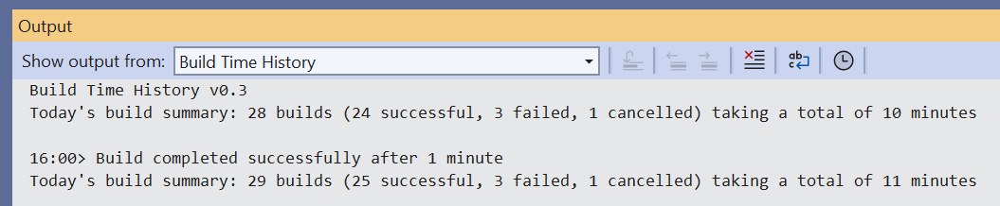

# Build Time History

Keep track of the total time spent waiting for code to build.

---

A Visual Studio Extension that provides a summary history of all the time spent waiting for code to build each day.

## How can I help?

If you enjoy using the extension, please give it a ★★★★★ rating on the Visual Studio Marketplace.

If you encounter bugs or have feature requests, go to [the GitHub repo to open an issue if one doesn't already exist](https://github.com/mrlacey/BuildTimeHistory/issues).

Another way to help is to [sponsor me on GitHub](https://github.com/sponsors/mrlacey).
